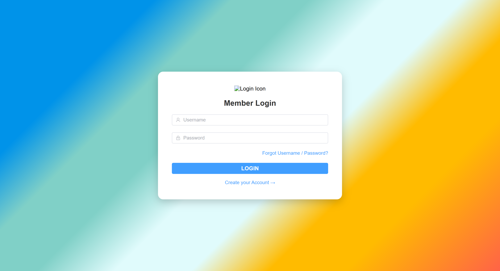
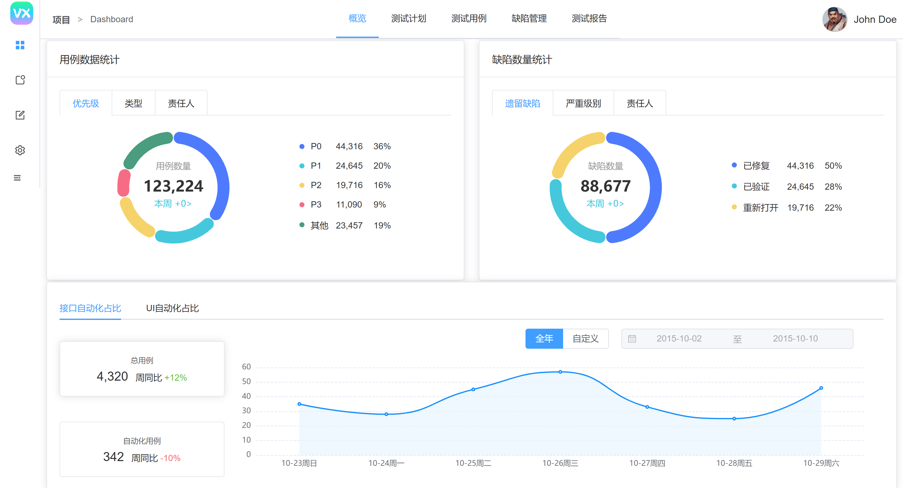
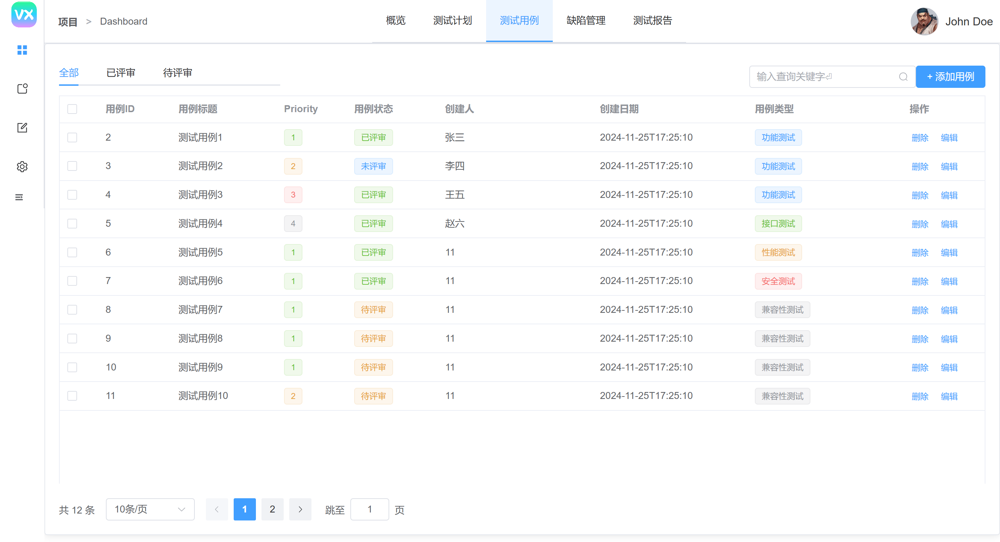
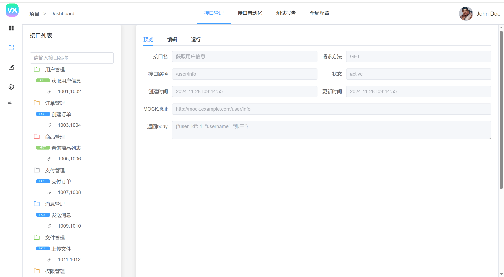
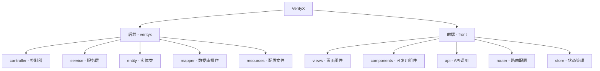

# VerityX 测试平台

<div align="center">


</div>

VerityX 是一个综合性测试管理平台，用于管理测试用例、接口测试、缺陷跟踪和测试报告等。该平台由前端（Vue.js）和后端（Spring Boot）两部分组成，旨在为测试团队提供高效、易用的测试管理工具。

## 📷 界面展示

<div align="center">

### 登录界面



### 系统首页



### 测试用例管理



### 接口测试



</div>

## 📑 目录

- [系统要求](#-系统要求)
- [界面展示](#-界面展示)
- [数据库配置](#-数据库配置)
- [后端项目启动](#-后端项目启动)
- [前端项目启动](#-前端项目启动)
- [默认用户](#-默认用户)
- [项目结构](#-项目结构)
- [API 文档](#-api-文档)
- [常见问题](#-常见问题)
- [贡献指南](#-贡献指南)
- [许可证](#-许可证)

## 📋 系统要求

- **JDK 17** 或更高版本
- **Maven 3.6.3** 或更高版本
- **MySQL 8.0** 或更高版本
- **Node.js 16.x** 或更高版本
- **npm 8.x** 或更高版本

## 🗃️ 数据库配置

1. 创建一个名为 `verityx` 的数据库：

```sql
CREATE DATABASE verityx CHARACTER SET utf8mb4 COLLATE utf8mb4_general_ci;
```

2. 使用 `verityxDatabase/CreateTable.sql` 文件中的 SQL 语句创建表结构：

```bash
mysql -u root -p verityx < verityxDatabase/CreateTable.sql
```

或者通过 MySQL 客户端工具导入 SQL 文件。

## 🚀 后端项目启动

<details>
<summary>1. 配置数据库连接</summary>

编辑 `verityx/src/main/resources/application.properties` 文件，确保数据库连接信息正确：

```properties
spring.datasource.url: jdbc:mysql://localhost:3306/verityx?useSSL=true&serverTimezone=UTC
spring.datasource.username: root
spring.datasource.password: 12345
```

根据你的实际数据库用户名和密码修改上述配置。
</details>

<details>
<summary>2. 构建并运行项目</summary>

```bash
# 进入后端项目目录
cd verityx

# 清理旧编译文件
mvn clean

# 重新编译
mvn compile

# 直接运行
mvn spring-boot:run
```

后端服务将在 `http://localhost:8089` 运行。
</details>

## 🖥️ 前端项目启动

<details>
<summary>1. 安装依赖</summary>

```bash
# 进入前端项目目录
cd front

# 安装依赖
npm install
```
</details>

<details>
<summary>2. 启动开发服务器</summary>

```bash
# 启动开发服务器
npm run serve
```

前端应用将在 `http://localhost:8080` 运行。
</details>

## 👤 默认用户

系统默认包含一个管理员用户：

- **用户名**：admin
- **密码**：123456 (如果你忘记了密码，可以通过下面的 SQL 语句重置)

如果忘记了密码，可以执行以下 SQL 语句重置为 `123456`：

```sql
UPDATE user_login 
SET password = '$2a$10$N.zmdr9k7uOCQb376NoUnuTJ8iAt6Z5EHsM8lE9lBOsl7iKTVKIUi' 
WHERE username = 'admin';
```

## 📁 项目结构

<div align="center">
  


</div>

### 后端结构

- **controller**: 控制器层，处理 HTTP 请求
- **service**: 服务层，实现业务逻辑
- **entity**: 实体类，对应数据库表
- **mapper**: Mapper 接口，数据库操作
- **resources/mapper**: MyBatis XML 映射文件

### 前端结构

- **views**: 页面组件
- **components**: 可复用组件
- **api**: API 调用接口
- **router**: 路由配置
- **store**: Vuex 状态管理

## 📚 API 文档

API 文档可以通过 Swagger UI 访问：`http://localhost:8089/swagger-ui.html`

## ❓ 常见问题

<details>
<summary>端口被占用</summary>
如果启动时报端口被占用错误，可以修改 `application.properties` 中的 `server.port` 属性。
</details>

<details>
<summary>数据库连接失败</summary>
请检查数据库用户名、密码和数据库名称是否正确。
</details>

<details>
<summary>前端无法连接后端 API</summary>
检查 `front/vue.config.js` 中的代理配置是否正确。
</details>

## 🤝 贡献指南

欢迎贡献代码！请阅读 [CONTRIBUTING.md](CONTRIBUTING.md) 了解如何参与项目开发。

## 📄 许可证

本项目采用 [MIT 许可证](LICENSE)。

---

<div align="center">
  
**VerityX** ©2023 Created by Your Team
  
<a href="https://github.com">
  
</a>
</div> 